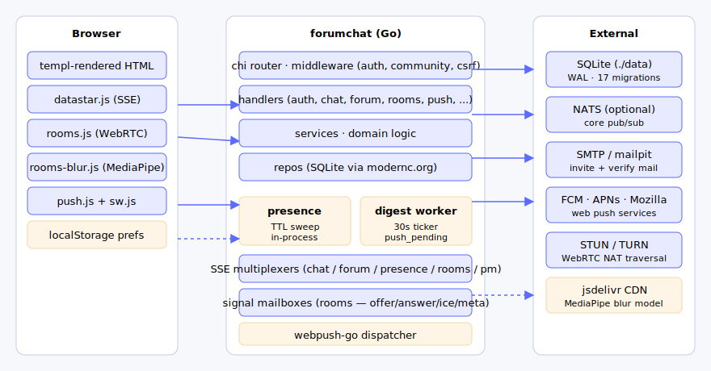
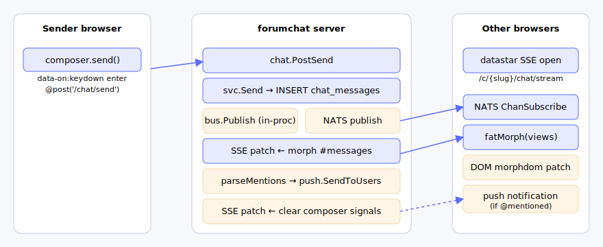
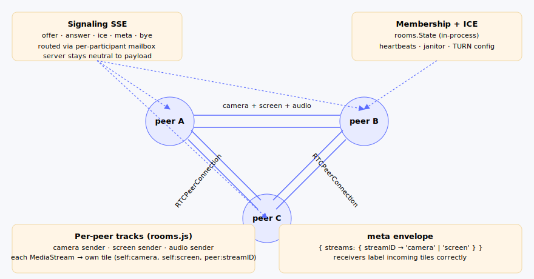
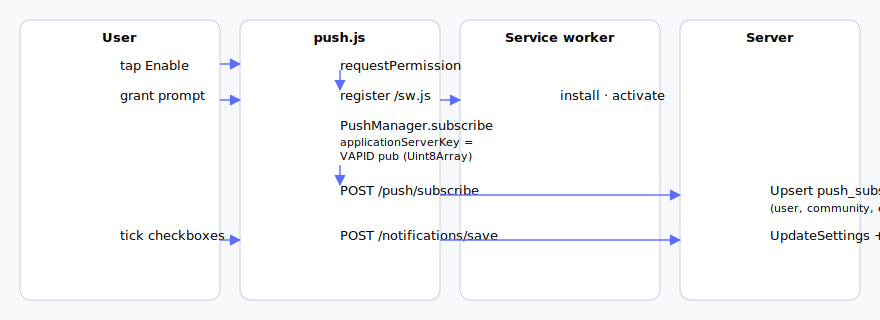
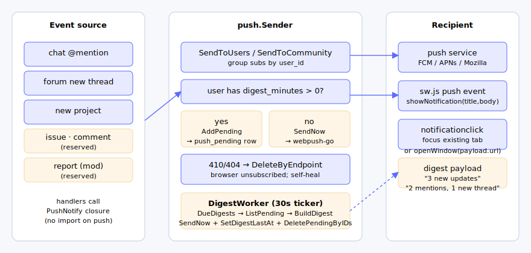

# ForumChat


[](https://youtu.be/rFDVdcsU5lU)


##  Everything begins from chat... 

[](https://youtu.be/vUgS1wlzTMc)


> **Self-hosted community platform in a single Go binary.** Realtime
> multi-channel chat, a durable forum, WebRTC video rooms, projects with
> issues, private messages, a per-community AI assistant, fused full-text +
> semantic search, IMAP email ingest, web push, and per-community moderation
> — one process backed by SQLite. AGPL-3.0.

If you've ever wanted **Discord + Discourse + Jitsi + Linear-lite + a
self-hosted ChatGPT rolled into one `docker run`**, that's the project. No
SaaS lock-in, no SPA build pipeline, no Kubernetes. Server-rendered HTML over
[Datastar](https://data-star.dev) SSE, ~70 MB image, runs on a $5 VPS or
a Raspberry Pi. Every AI feature points at your own Ollama daemon — no
third-party API key required, nothing leaves your box.

**Built for:** indie hacker communities, study cohorts, family/club
servers, classroom backchannels, open-source project lounges, internal
team spaces, **and freelance / agency client workspaces** — anywhere
a Discord + forum mix would fit but you want to own the data.

> **Each client / company you work with = one community.** Decisions
> live in the forum, day-to-day chatter in chat, deliverables in
> projects (issues + attachments + todos), kickoff calls in the video
> rooms, every file shared via signed upload URLs — all per-client
> siloed under `community_id`. Replace the Slack + Notion + Google Drive
> + Zoom + Loom stack you cobbled together for each engagement with a
> single tab the client can bookmark, and keep the whole history when
> the project ends.

> **Sweet spot:** a solo freelancer or two-person studio with a
> handful of long-term clients — three to ten communities, a few
> contacts each, conversations measured in months not minutes. The
> SQLite + single-binary model is cheap to host and trivial to back
> up (one file), the forum keeps low-frequency context where you'll
> actually find it years later, and per-community push digests stop
> your phone buzzing every time a client types. No seat pricing, no
> tier upsell, no "your free workspace will be archived" emails.

**Pick forumchat if you want:**

- **One binary, one DB file.** SQLite (CGO-free), no Postgres/Redis/queue to babysit. NATS optional.
- **Multi-channel realtime chat.** Discord-style named text channels, durable in SQLite, with mentions, image paste/drop, multi-file attachments, reply quote, forward, and per-channel unread dots.
- **Self-hosted AI assistant.** Per-community ChatGPT-style agent with persistent threads, streaming answers, vision, multiple named agents, and a tool layer (internal full-text/semantic search + connectable MCP servers). Backed by *your* Ollama.
- **Fused search.** SQLite FTS5 (instant) + semantic vector search (RAG) merged by Reciprocal Rank Fusion across chat, forum, projects, issues, and AI threads.
- **Slash commands in chat.** `/search`, `/resume` (AI recap of the channel), `/prompt` (run a prompt → thread), `/translate` (live typeahead, auto-detected source language).
- **Email in.** Optional read-only IMAP ingest: per-community filters route matched mail into an inbox, optionally auto-file as project issues.
- **Built-in video rooms.** Mesh WebRTC, screen + camera as independent tiles, no Jitsi sidecar.
- **Push notifications that don't spam.** Per-event toggles + 5 / 15 / 60 / 240-min digest mode.
- **Two-step sign-in with magic link.** Email-then-password OR email-me-a-link, anti-enumeration by default.
- **Lobbies for outsiders.** Share a tokenised URL with someone who doesn't have an account — they pick a name, you talk, history persists, image uploads work. Set `GUEST_ACCESS_ENABLED=true`.
- **Time accounting.** Per-community monthly budget + a global personal work timer/journal that follows you across communities.
- **Multi-community by default.** Every row is `community_id`-scoped; public communities discoverable under `/explore`. Platform super-admins get god-mode + a global dashboard.
- **Boring stack.** Go 1.25 · chi · templ · Datastar · scs sessions · SQLite + goose migrations. No JS framework.

**Try it in 30 seconds:**

```bash
docker run -p 8080:8080 \
  -v $PWD/data:/data \
  -v $PWD/uploads:/uploads \
  -e UPLOADS_DIR=/uploads \
  ghcr.io/atvirokodosprendimai/forumchat:latest
# → open http://localhost:8080 — first user becomes admin
#   data/      → sqlite db + persisted VAPID keys
#   uploads/   → user-uploaded files (kept as a separate folder so backup
#                policies can treat blobs differently from the metadata db)
```

[Quickstart](#local-development) · [What you get](#what-you-get) · [Architecture](#system-architecture) · [Configuration](#configuration) · [Roadmap](#roadmap)

---

## Table of contents

- [What you get](#what-you-get)
- [System architecture](#system-architecture)
- [Tech stack](#tech-stack)
- [Realtime chat + channels](#realtime-chat--channels)
- [Slash commands](#slash-commands)
- [AI assistant (Agent)](#ai-assistant-agent)
- [Search — FTS5 + semantic (RAG)](#search--fts5--semantic-rag)
- [Email ingest (mailbox)](#email-ingest-mailbox)
- [Time accounting](#time-accounting)
- [Video rooms](#video-rooms-webrtc-mesh)
- [Push notifications + digest mode](#push-notifications--digest-mode)
- [Projects, issues, discussions](#projects-issues-discussions)
- [Auth, sessions, communities](#auth-sessions-communities)
- [Data model](#data-model)
- [Configuration](#configuration)
- [HTTP routes](#http-routes)
- [Project layout](#project-layout)
- [Local development](#local-development)
- [Production notes](#production-notes)
- [Roadmap](#roadmap)

---

## What you get

| Area              | What's there                                                                                                                                                     |
|-------------------|------------------------------------------------------------------------------------------------------------------------------------------------------------------|
| **Multi-community** | Communities are first-class. Every row is `community_id`-scoped. Public communities appear under `/explore`; private ones are invite-only. Platform super-admins (`SUPERADMIN_EMAILS`) get a global `/superadmin` dashboard + god-mode across every community. |
| **Chat**            | Multiple realtime named text channels per community (Discord-style, `#general` is the undeletable default). Persistent (SQLite), live (NATS pub/sub + datastar SSE), auto-grow composer, mentions, image paste/drop, multi-file attachments, reply quote, forward-to-channel, per-channel unread dots. Extract any chat attachment into a project (as Docs or a new issue) so documents shared in chat aren't lost to scrollback. |
| **Slash commands**  | In the chat composer: `/search` (personal fused search panel), `/resume` (AI recap of the channel → thread), `/prompt` (run a prompt → thread), `/translate` (live English-translation typeahead, source auto-detected). |
| **AI assistant**    | Optional (`AI_ENABLED`). Per-community ChatGPT-style Agent: persistent threads + history, streaming answers (100 ms morph cadence), vision/image input, multiple named agents (provider/model/system-prompt each), in-thread model switch, resumable streams, `$`-reference autocomplete, share-thread-to-channel. Tool layer: internal full-text + `rag_search` + DB tools (list/get issues) + connectable MCP servers. Backed by your own Ollama. |
| **Search**          | Fused search over chat, forum, projects, issues, discussions, and shared AI threads. SQLite **FTS5** (synchronous, trigger-maintained) + optional **semantic vector** index (RAG, `RAG_ENABLED`) merged by Reciprocal Rank Fusion; every hit resolves to a deep link. Page at `/search`, the `/search` chat slash command, and share-result-to-channel. |
| **Email ingest**    | Optional (`MAILBOX_ENABLED`). Read-only IMAP poll worker; per-community filters route matched mail into a global `/inbox`, attachments indexed metadata-only (bytes fetched on demand), optional auto-create of project issues from matched mail. |
| **Time accounting** | Optional (`TIME_ENABLED`). Per-community recurring **monthly budget** (admins set, mods/members log entries, used-vs-remaining resets each calendar month) + a **global** per-user work timer/journal ("what did you do?" on stop) that follows you across communities. |
| **Forum**           | Threads + flat replies, optional single-parent quote, 15-min self-delete grace, resolved/unresolved filter, search, thread → chat bridge announcement.            |
| **Rooms (video)**   | Eight always-on WebRTC meeting rooms per community. Mesh topology, lazy media policy, screen+camera as independent tiles, background blur, stage fullscreen.     |
| **Projects**        | Optional feature flag. Each project carries discussions, issues (status + comments + attachments), todos, attachments, activity log. Share-link guest viewers. Files shared in chat can be filed straight here via extract-to-project, so nothing important stays buried in chat history. |
| **Private messages**| Request-based DMs. Recipient must accept before threads open. Live SSE updates + dock toast.                                                                      |
| **Lobbies (guest access)** | Optional feature flag (`GUEST_ACCESS_ENABLED`). Admin / mod mints a tokenised URL; recipient joins, picks a name, full realtime chat with image paste/drop, history persists. Promote-to-member mints an invite tied to the captured email. |
| **Push**            | Web Push (VAPID) with per-community settings, per-event toggles, digest mode (immediate / 5 / 15 / 60 / 240 min).                                                 |
| **Notifications**   | Service worker delivers OS-level pushes; user picks which events wake them and the cadence.                                                                       |
| **Moderation**      | admin / moderator / member roles. Soft-delete with role-aware render. Ban with optional content cleanup window. Trust level reserved for later.                  |
| **Uploads**         | Content-addressed (sha256), HMAC-signed time-bound URLs scoped to viewer + community.                                                                            |
| **Auth**            | Invite-code registration, email verification, cookie sessions (scs), bcrypt cost 12.                                                                              |
| **Bookmarks**       | Per-community, optional folder, attached to chat messages or forum posts.                                                                                         |
| **Todos**           | Per-community, sourced from a chat message or a forum post, status workflow.                                                                                      |
| **History**         | Calendar of community activity; click a date → chronological event list.                                                                                          |
| **Explore**         | Discover public communities; request to join (admin approves).                                                                                                    |

---

## System architecture

The whole server fits in one Go binary. The request side, the realtime side,
and the background workers all share the same process and the same DB.



**Degradation budget**: NATS optional (chat fan-out falls back to single-process
in-memory bus); SMTP optional (`LogMailer` writes URLs to stdout); TURN
optional (mesh-only rooms still work between same-LAN peers); VAPID env values
optional (one-time auto-generation persisted to `./data/vapid.json`).

---

## Tech stack

| Layer            | Choice                                                                |
|------------------|-----------------------------------------------------------------------|
| Language         | Go 1.25                                                              |
| HTTP router      | `github.com/go-chi/chi/v5`                                            |
| Templating       | `github.com/a-h/templ` (compile-time HTML, all components in `web/templ`) |
| Realtime UI      | [Datastar v1](https://data-star.dev) over Server-Sent Events          |
| Messaging        | NATS core pub/sub (`github.com/nats-io/nats.go`)                      |
| DB               | SQLite via `modernc.org/sqlite` (CGO-free), WAL mode                  |
| Migrations       | `github.com/pressly/goose/v3` (embedded SQL files)                    |
| Markdown         | `yuin/goldmark` + `microcosm-cc/bluemonday`                           |
| Sessions         | `github.com/alexedwards/scs/v2` (SQLite-backed store, survives restart) |
| Password hash    | bcrypt cost 12                                                        |
| Rate limit       | `github.com/go-chi/httprate`                                          |
| AI / LLM         | Your own [Ollama](https://ollama.com) — chat agents, `bge-m3` embeddings, translation (all point at configurable endpoints) |
| Vector store     | `github.com/philippgille/chromem-go` (embedded; qdrant backend reserved) |
| Search           | SQLite FTS5 + semantic vectors fused by Reciprocal Rank Fusion        |
| MCP              | Connectable Model Context Protocol servers (HTTP always; stdio gated) + a built-in internal server |
| IMAP ingest      | `github.com/emersion/go-imap/v2` (read-only EXAMINE + BODY.PEEK)      |
| HTML→text        | `github.com/jaytaylor/html2text` (email body normalisation)          |
| Web push         | `github.com/SherClockHolmes/webpush-go` (VAPID, RFC 8030)             |
| WebRTC           | Browser-native (mesh) — no SFU. Signaling rides the same SSE stream.  |
| Background blur  | MediaPipe Selfie Segmentation v0.1 (lazy-loaded from jsdelivr)        |
| Email (dev)      | SMTP → mailpit (UI at `localhost:8025`)                               |
| Containers       | Distroless `nonroot`, multi-stage Dockerfile                          |
| Frontend         | Inter Variable + JetBrains Mono, OKLCH palette tokens, 2026 design refresh |

---

## Realtime chat + channels

Chat is the closest thing to a global state animation in the system. Persistence
is in SQLite, fan-out across the cluster (or just multiple tabs) is via NATS
core pub/sub, and the UI updates via Datastar over Server-Sent Events.



Key design points:

- **Multiple channels per community**: chat is split into admin/mod-curated,
  all-public named text channels (`#general` is the undeletable default).
  Routes are per-channel (`/c/{slug}/chat/{channel}`); a bare `/chat` redirects
  to `#general`. Every member reads + writes every non-archived channel — no
  per-channel membership table, just a `channel_id` column. Soft cap of 10
  non-archived channels.
- **Datastar-first rendering**: every UI mutation is a server-rendered HTML
  fragment. The browser does not keep a model of the chat — it morphs a
  `#messages` div from a snapshot the server pushes ("fat-morph"). Datastar v1
  syntax with `data-on:` (colon, not hyphen) is used everywhere.
- **One stream, channel id on the wire**: the SSE stream fat-morphs `#messages`
  only when the changed channel is the one you're viewing; for other channels it
  flips a per-channel unread dot. Unread dots seed on page load and clear on the
  active channel.
- **NATS optional**: when not connected, the in-process bus still fans out to
  every SSE stream attached to the same process. Useful for tests and tiny
  deployments.
- **Reconnect-safe**: every reconnection of a channel's `/stream` triggers a full
  morph of the most-recent 100 messages, so a sleeping tab never gets stuck
  with stale state.
- **Forward + reply + extract**: forward a message to another channel
  (Discord-style), reply with an inline quote, promote a message to a forum
  thread, or extract a chat attachment straight into a project (as Docs or a
  new issue).
- **Mentions → push**: `parseMentions` walks the body for `@token` runs,
  resolves them to user IDs through `auth.Repo.UserIDsByDisplayName`
  (case-insensitive), and fires the `PushNotify` closure with
  `kind: "mention"` for any opted-in subscriber.
- **Block / report**: per-user block (hides their messages for you) and report
  to moderators, both live-updating the presence sidebar.

---

## Slash commands

The chat composer recognises a handful of `/slash` commands. They are typed
like a normal message; the send handler intercepts the prefix. All are
optional and degrade to silent no-ops when their backing feature is disabled.

| Command       | Backed by        | What it does                                                                                                  |
|---------------|------------------|--------------------------------------------------------------------------------------------------------------|
| `/search <q>` | FTS5 + RAG       | Runs a fused full-text + semantic search and shows results in an **ephemeral panel visible only to you** (not posted). A result can then be shared to the channel. |
| `/resume`     | AI agent         | Summarises the channel's recent history (~last 300 messages) with an agent in a public agent thread, then posts the recap back into the channel. |
| `/prompt <p>` | AI agent         | Runs a free-form prompt through an agent in a new public thread and posts the result (+ a link to the thread) back to the channel. |
| `/translate <text>` | Ollama     | Interactive composer typeahead: a popup offers up to 3 English translations (source language auto-detected) that you send as yourself. 150 ms debounced. |

`/resume`, `/prompt`, and `/translate` are wired as closures in `main.go` so the
chat package bridges to the agent/translate packages without an import cycle.
`/search` and `/resume` / `/prompt` differ in visibility: search results are
personal; resume/prompt outputs are posted for everyone.

---

## AI assistant (Agent)

Optional, behind `AI_ENABLED=true` (and a per-community `ai_configs.enabled`
toggle on top of it). When on, each community gets `/c/{slug}/agent` — a
ChatGPT-style assistant with persistent threads and history backed by SQLite.

- **Multiple named agents per community.** Each agent is a full independent
  config (provider, connection/base URL, model, key, system prompt) with an
  optional **vision** flag. A thread pins to one agent for its lifetime; you can
  switch the model in-thread.
- **Streaming, resumable.** A pluggable provider (Ollama first; Claude/OpenAI
  reserved) streams the answer into the DB on a ~100 ms cadence, so any open SSE
  stream fat-morphs the whole conversation. A stream interrupted by a restart is
  marked `interrupted` with the partial kept — never a half-written ghost.
- **Threads are private or shared.** Private threads are creator-only; shared
  threads any approved member can read and continue. Only **shared** AI content
  is ever indexed for search.
- **`$`-reference autocomplete.** Type `$` to expand referenced thread content
  into the prompt without copy-paste.
- **Tool layer (MCP).** Agents can call tools: a built-in **internal MCP server**
  (full-text search, `rag_search` semantic search, and DB tools `list_issues` /
  `get_issue` for context loading) plus **connectable external MCP servers**.
  HTTP MCP servers are always allowed; **stdio** servers run host commands and
  are gated behind `AGENT_MCP_ALLOW_STDIO=true`.
- **Admin config UI** lives at `/c/{slug}/admin/ai` (create/edit/delete agents,
  manage MCP servers) — not in the global admin.

All of it points at *your* Ollama daemon; no third-party key is required and no
content leaves the box.

---

## Search — FTS5 + semantic (RAG)

Two indexes, one ranked result list:

- **Full-text (always on).** A SQLite **FTS5** index (`search_fts`) is kept live
  by SQL triggers, independent of any feature flag. Covers chat, threads, posts.
- **Semantic (optional, `RAG_ENABLED`).** SQL triggers (migration 00039) enqueue
  changed rows into `embed_outbox`; a background worker drains the queue, embeds
  each row's text via an **Embedder** (Ollama `bge-m3`, 1024-dim by default), and
  upserts chunks into a pluggable vector **Store** (`chromem-go` now, qdrant
  reserved). It covers more kinds: chat, thread, post, issue, issue comment,
  discussion, discussion reply, project, and **shared** AI threads.
- **Fusion.** `internal/search` merges the two via **Reciprocal Rank Fusion**
  (RRF, `k=60`) and resolves every hit to a deep link into the UI.

Authorization is structural: only community-public content is ever embedded
(AI messages only from shared threads), and every query is filtered by
`community_id` — the vector store has no concept of users. The semantic side is
wired into `internal/search` as a closure, so `search` imports neither `rag` nor
`agent` (leaf-package discipline, per `AGENTS.md` §4.13). Surfaces: the `/search`
page, the `/search` chat slash command, and the agent's `rag_search` tool.

Admins/super-admins can rebuild the indexes via `/admin/reindex` (per community)
or `/superadmin/reindex` (all).

---

## Email ingest (mailbox)

Optional, behind `MAILBOX_ENABLED=true`. A poll worker dials a single shared
IMAP account **read-only** (EXAMINE + `BODY.PEEK[]` only — never `\Seen`
mutation or MOVE) every `MAILBOX_POLL_INTERVAL`.

- **Per-community filters** route matched messages into a global `/inbox`.
- **Attachments are indexed metadata-only**; the bytes are fetched on demand at
  "Move to project" click (capped by `MAILBOX_ATTACHMENT_MAX`, 25 MiB default).
- **Auto-issue**: a filter with `to_issue=true` auto-creates a `project_issues`
  row from the mail, credited to a synthetic `MAILBOX_SYSTEM_USER_ID`. Bodies
  are normalised HTML→text and markdown-escaped.
- `MAILBOX_RESCAN_ON_BOOT=true` resets every folder's `last_uid` to 0 so the
  next poll re-scans historical mail (set once, restart, then set back to false).

Filter management lives under `/c/{slug}/admin/mail-filters`; the inbox itself
(`/inbox`, with live SSE) is session-level (any signed-in user).

---

## Time accounting

Optional, behind `TIME_ENABLED=true`. Two independent pieces:

- **Community monthly budget** (`/c/{slug}/budget`). The whole community is
  treated as one client: admins set a recurring monthly budget (in minutes),
  admins/moderators log manual time entries (optionally tagged to a project),
  and every approved member sees used-vs-remaining. "Used" is the sum of entries
  dated in the current calendar month; the budget resets each month.
- **Personal timer + journal** (`/journal`). A **global** (not community-scoped)
  per-user work timer: start it, watch the elapsed time tick, and on stop you're
  asked "what did you do?" — the answer becomes a journal entry. A partial unique
  index guarantees at most one running timer per user.

The tables always exist, so toggling `TIME_ENABLED` never needs a migration.

---

## Video rooms (WebRTC mesh)

Each community owns eight always-on meeting rooms. Whoever joins first becomes
the room admin (rename / public/private toggle / share-link / per-email
invites). Topology is a classic mesh: every participant holds one
`RTCPeerConnection` per other participant, and signaling rides on top of the
same Datastar SSE stream that the page already opened — no second EventSource,
no socket gymnastics.



Notable choices:

- **Lazy media**: no `getUserMedia` on join. Camera + mic start OFF until the
  user clicks the toggle. Toggling off releases the device (LED off), not
  `.enabled = false`.
- **Independent screen + camera**: enabling screenshare adds a new
  `RTCRtpSender` (`senders.screen`) without replacing the camera sender, so
  viewers see two distinct tiles and can stage either one.
- **Background blur** (default on): the raw camera track is fed into a
  MediaPipe Selfie Segmentation pipeline; the composited canvas is then
  `captureStream(24)`'d and that synthetic track is the one that goes to peers.
  Falls back to raw camera if MediaPipe fails to load. Toggle persists to
  `localStorage`.
- **meta sidecar signal**: stream IDs are stable on the wire but carry no role
  label. A small JSON envelope per peer maps `{streamID → "camera"|"screen"}`
  so receivers paint the right tile chrome (camera tile vs. amber-outlined
  screen tile with 🖥 icon).
- **Stage fullscreen**: dedicated button (top-right of stage), `dblclick`, or
  `f` keypress. Browser-native fullscreen with object-fit contain so screen
  shares stay legible at native resolution.
- **Self-healing TURN**: ICE failures trigger `pc.restartIce()`. ICE candidate
  POSTs are best-effort; the server queues envelopes per recipient so a transient
  re-admission doesn't lose the burst.

---

## Push notifications + digest mode

Web Push is the most architecturally interesting recent addition. It spans the
service worker on the client, a VAPID key pair, a subscription DB, a
fire-and-forget sender, and a polling worker that batches messages for digest
recipients.

### Subscribe flow



A few non-obvious bits:

- **`/sw.js` is served from the root**, not from `/static/sw.js`, so the
  service worker can claim scope `'/'`. The handler sets
  `Service-Worker-Allowed: /` for belt-and-braces.
- **VAPID keys**: env values win; otherwise the file at `VAPID_KEYS_FILE`
  (default `./data/vapid.json`) wins; otherwise a fresh pair is generated and
  persisted so reloads keep working. Production should pin via env so a new
  disk doesn't invalidate every browser subscription.
- **Subscriptions are per `(user, community, endpoint)`**: one row per device
  per community. Settings live in the same row as `settings_json` plus
  `digest_minutes` / `digest_last_at` columns.

### Dispatch + digest



### Digest mode guarantees

The dropdown on `/c/{slug}/notifications` lets users pick *Immediately / Every
5 / 15 / 60 / 240 minutes*. The contract is intentionally narrow:

- **No silent ticks**. The worker's `DueDigests` query joins
  `push_subscriptions` to `push_pending` and only returns pairs that have
  buffered rows — empty buffer means no notification.
- **No duplicates**. After `BuildDigest` dispatches, the consumed rows are
  deleted from `push_pending` and `digest_last_at` is bumped on every
  subscription for that `(user, community)`. The cooldown restarts uniformly
  across the user's devices.
- **Mixed devices coexist**. A subscription with `digest_minutes = 0` always
  fires immediately. A second subscription on the same user/community with
  `digest_minutes = 5` participates in the digest cycle. Same user, two
  devices, two cadences — fine.

### Decoupling the producers

The chat / forum / projects packages never import the push package. Each one
exposes a `PushNotify` closure field of type:

```go
func(ctx context.Context, communityID, kind string, userIDs []string,
     title, body, url string)
```

`main.go` wires a single closure that adapts the call into either
`pushSender.SendToUsers` (when `userIDs` is non-empty — target mode) or
`pushSender.SendToCommunity` (broadcast). Adding a new event is a one-line
hook call inside the producer + a new toggle on the settings page.

| Event       | Producer             | Mode                                 | Settings key   |
|-------------|----------------------|--------------------------------------|----------------|
| `mention`   | `chat.PostSend`      | target (parsed `@name`s)             | `mention`      |
| `thread_new`| `forum.PostNew`      | broadcast                            | `thread_new`   |
| `project_new`| `projects.PostCreate`| broadcast                           | `project_new`  |
| `report`    | *(reserved)*         | target (mods)                        | `report`       |
| `issue_new` | *(reserved)*         | broadcast                            | `issue_new`    |
| `comment_new`| *(reserved)*        | target (issue subscribers)           | `comment_new`  |

---

## Projects, issues, discussions

Optional feature behind `PROJECTS_ENABLED=true`. When on, each community gets:

- `/c/{slug}/projects` — grid landing
- per-project page with tabs for *Description · Discussions · Issues · Todos
  · Attachments · Activity*
- **Discussions** — forum-style threads scoped to a single project (replies
  with single-parent quote)
- **Issues** — title, body, status (`open`/`in_progress`/`done`/`closed`),
  comments, attachments
- **Share-link guests** — admins mint a time-limited token that lets external
  collaborators view a single project without an account; identity tracking via
  `projects.Identity` keeps writes attributed even for guests

DB tables (numbered by migration): `projects` (00013), `project_issues`,
`project_issue_comments`, `project_issue_attachments` (00014),
`project_discussions`, `project_discussion_replies` (00015).

---

## Auth, sessions, communities

- Registration is **invite-only** by default (or zero-state bootstrap promotes
  the first user to admin). `OPEN_REGISTRATION` makes the invite code optional;
  `OPEN_REGISTRATION_AUTO_APPROVE` skips the pending-approval queue;
  `AUTO_VERIFY_EMAIL` skips the email step and signs the user in immediately. The
  three flags are independent and compose (meant for short demo windows).
- Two-step sign-in: email → password, **or** email-me-a-magic-link.
  Anti-enumeration by default (hit/miss responses are identical).
- Email verification is mandatory (unless `AUTO_VERIFY_EMAIL`); the `LogMailer`
  fallback writes the URL to stdout for dev convenience.
- Membership has an **approval queue** (`memberships.approved_at`): verified
  users land in `/pending` until an admin approves, Discord-style.
- Sessions are `alexedwards/scs` v2 with a **SQLite-backed store** so they
  survive restart. Cookie name `forumchat_session`, max-age driven by
  `SESSION_MAX_AGE`, `Secure` toggled by `ENV`.
- Bcrypt cost **12**; minimum password length 8 (boundary tests in
  `internal/auth`).
- Roles: `member` < `moderator` < `admin`. `RequireRole` middleware ladders.
  Trust level reserved for post-MVP Discourse-style tiers.
- Communities are first-class. Every multi-tenant row carries `community_id`;
  the `LoadCommunity` middleware resolves the URL `{slug}` into a context
  value the handlers read via `community.FromContext`.
- Per-user profile (display name + avatar) writes to **every** membership the
  user holds — the profile editor is "you", not "you in this community".

---

## Data model

39 SQL migrations, embedded via goose and applied on boot (toggle with
`MIGRATE_ON_BOOT`). All tables are `community_id`-scoped where relevant.

| # | Migration                              | What it adds                                                |
|---|----------------------------------------|-------------------------------------------------------------|
| 1 | `00001_init.sql`                       | users, sessions, verification_tokens, communities, memberships, invite_codes, chat_messages, threads, posts, uploads |
| 2 | `00002_invite_queue_and_cleanup.sql`   | pending_users, content-cleanup audit trail                  |
| 3 | `00003_bookmarks.sql`                  | bookmarks                                                   |
| 4 | `00004_thread_resolved.sql`            | resolved flag on threads                                    |
| 5 | `00005_chat_promoted.sql`              | chat → thread promotion link                                |
| 6 | `00006_todos.sql`                      | todos                                                       |
| 7 | `00007_signup_tokens.sql`              | admin-minted signup URLs                                    |
| 8 | `00008_fix_announce_links.sql`         | data fix                                                    |
| 9 | `00009_private_messages.sql`           | pm_threads, pm_messages                                     |
|10 | `00010_community_public.sql`           | community public flag for /explore                          |
|11 | `00011_rooms.sql`                      | rooms, room_pending                                         |
|12 | `00012_rooms_per_community.sql`        | room scoping fix                                            |
|13 | `00013_projects.sql`                   | projects                                                    |
|14 | `00014_project_issues.sql`             | project_issues + comments + attachments                     |
|15 | `00015_project_discussions.sql`        | project_discussions + replies                               |
|16 | `00016_push_subscriptions.sql`         | push_subscriptions                                          |
|17 | `00017_push_digest.sql`                | digest_minutes + digest_last_at + push_pending              |
|18 | `00018_project_categories_and_chat_digest.sql` | project categories + project→chat digest state     |
|19 | `00019_lobbies.sql`                    | lobbies (tokenised guest access)                            |
|20–25 | `00020`–`00025_mailbox_*.sql`       | mailbox: messages, FTS search, global ingest, msg-id index, body HTML, attachment encoding |
|26 | `00026_chat_reads.sql`                 | per-user read high-water marks                              |
|27 | `00027_uploads_filename.sql`           | original filename on uploads                                |
|28 | `00028_chat_message_attachments.sql`   | N-attachments-per-message link table                        |
|29 | `00029_chat_attachment_extracts.sql`   | extract-to-project badge state                              |
|30 | `00030_user_blocks.sql`                | per-user blocks                                             |
|31 | `00031_user_reports.sql`               | report-to-moderator                                         |
|32 | `00032_chat_channels.sql`              | chat_channels + per-channel scope (+ rebuilt chat_reads)    |
|33 | `00033_time_budget.sql`                | community monthly budget + time entries                     |
|34 | `00034_worklog.sql`                    | global per-user timer sessions + journal                    |
|35 | `00035_chat_forward.sql`               | forward-to-channel provenance                               |
|36 | `00036_agent.sql`                      | agent threads + messages (per-community AI chat)            |
|37 | `00037_ai_agents.sql`                  | named per-community agents (provider/model/prompt/vision)   |
|38 | `00038_agent_tools_mcp.sql`            | MCP servers + FTS5 `search_fts` index                       |
|39 | `00039_rag_embed_outbox.sql`           | embed_outbox + triggers for semantic indexing               |

Key invariants:

- `chat_messages.kind` + nullable `author_id` covers system messages like
  `thread_announce`.
- `chat_messages.promoted_thread_id` carries the chat → forum bridge.
- `memberships.trust_level` reserved for Discourse-style tiers.
- `push_subscriptions` is keyed by `(user_id, community_id, endpoint)` —
  multiple devices per user are just multiple rows.
- `push_pending` rows are deleted after the digest worker drains them, so the
  table stays small.

---

## Configuration

All configuration is via environment variables (or a `.env` file in the
working directory, auto-loaded by godotenv). Defaults are dev-friendly; prod
boot fails fast on placeholder secrets.

### Core

| Variable             | Default                                | Purpose                                                            |
|----------------------|----------------------------------------|--------------------------------------------------------------------|
| `ENV`                | `dev`                                  | `dev` or `prod`. Toggles slog text/json + cookie `Secure` flag.    |
| `HTTP_ADDR`          | `:8080`                                | Listen address.                                                    |
| `BASE_URL`           | `http://localhost:8080`                | Public origin. Used to build verification / invite / push URLs.     |
| `DB_PATH`            | `./data/forumchat.db`                  | SQLite file (auto-creates parent dir).                             |
| `MIGRATE_ON_BOOT`    | `true`                                 | Auto-run goose migrations at startup. Set `false` in prod CI/CD.   |
| `NATS_URL`           | `nats://127.0.0.1:4222`                | NATS connection URL; app degrades gracefully if unreachable.        |
| `SESSION_KEY`        | dev placeholder                        | scs cookie signing key. **Must not contain `dev-only` in prod.**   |
| `SESSION_MAX_AGE`    | `720h` (30 days)                       | Cookie lifetime + idle timeout.                                    |
| `PRESENCE_TTL`       | `30s`                                  | Heartbeat age after which a user drops from the online list.       |
| `EDIT_GRACE`         | `15m`                                  | Window for self-delete of thread / post / chat message.            |
| `COMMUNITY_SLUG`     | `main`                                 | Slug of the bootstrap community.                                   |
| `COMMUNITY_NAME`     | `The Community`                        | Human-friendly name.                                               |
| `OPEN_REGISTRATION`  | `false`                                | Allow self-registration without an invite code. When off, `/register` requires a valid invite. |
| `OPEN_REGISTRATION_AUTO_APPROVE` | `false`                    | Auto-approve every new member at email-verification time (open **or** invite-based signups). Off → members land in the pending approval queue. Independent of `OPEN_REGISTRATION`. Flags load at boot — restart after changing. |
| `AUTO_VERIFY_EMAIL`  | `false`                                | Skip email verification: registrants are activated and **signed in immediately**, no verify link. For short demo windows (turn on, record/invite, turn off). Combine with the two flags above for instant full access. Leave off normally — anyone can register with an unverifiable email. |
| `SUPERADMIN_EMAILS`  | _(empty)_                              | Comma-separated email allowlist of **platform super-admins**. A signed-in user whose email matches (case-insensitive) gets god-mode across every community: enter any `/c/<slug>/admin` without a membership, set roles anywhere, plus the global `/superadmin` dashboard (all communities + all users). Immutable at runtime — change the env and restart. Empty = no super-admins. |

### Uploads

| Variable             | Default                                | Purpose                                                            |
|----------------------|----------------------------------------|--------------------------------------------------------------------|
| `UPLOADS_DIR`        | `./uploads`                            | Local-disk uploads root (content-addressed sha256).                |
| `UPLOADS_MAX_BYTES`  | `104857600` (100 MiB)                  | Per-upload size cap. (In-chat pasted images are separately capped at 1 MiB.) |
| `UPLOADS_SIGN_KEY`   | dev placeholder                        | HMAC key for signed URLs. **Must not contain `dev-only` in prod.** |

### Email

| Variable             | Default                                | Purpose                                                            |
|----------------------|----------------------------------------|--------------------------------------------------------------------|
| `SMTP_HOST`          | `127.0.0.1`                            | SMTP relay. Set to an unreachable host to force `LogMailer` fallback. |
| `SMTP_PORT`          | `1025`                                 | Mailpit-friendly default.                                          |
| `SMTP_USER` / `PASS` | empty                                  | Optional PLAIN auth.                                               |
| `SMTP_FROM`          | `forumchat@localhost`                  | From header.                                                       |
| `SMTP_TLS`           | `auto`                                 | `auto` / `starttls` / `tls` / `none`.                              |
| `SMTP_TLS_INSECURE`  | `false`                                | Skip cert verification.                                            |

### Rooms (WebRTC)

| Variable             | Default                                | Purpose                                                            |
|----------------------|----------------------------------------|--------------------------------------------------------------------|
| `ROOMS_STUN_URLS`    | `stun:stun.l.google.com:19302`         | Comma-separated STUN URLs.                                         |
| `ROOMS_TURN_URL`     | empty                                  | Optional TURN URL.                                                 |
| `ROOMS_TURN_USERNAME`| empty                                  | TURN auth.                                                         |
| `ROOMS_TURN_PASSWORD`| empty                                  | TURN auth.                                                         |

### Push

| Variable             | Default                                | Purpose                                                            |
|----------------------|----------------------------------------|--------------------------------------------------------------------|
| `VAPID_PUBLIC`       | empty                                  | Override the auto-generated VAPID public key.                      |
| `VAPID_PRIVATE`      | empty                                  | Override the auto-generated VAPID private key.                     |
| `VAPID_SUBJECT`      | `mailto:admin@example.com`             | RFC 8030 subscriber; shown in push-service dispatch logs.          |
| `VAPID_KEYS_FILE`    | `./data/vapid.json`                    | Where auto-generated keys are persisted.                           |

### Features

| Variable             | Default                                | Purpose                                                            |
|----------------------|----------------------------------------|--------------------------------------------------------------------|
| `PROJECTS_ENABLED`   | `false`                                | Mount `/c/{slug}/projects` and show the sidebar link.              |
| `WEBHOOKS_ENABLED`   | `false`                                | Mount the public `POST /hooks/{token}` receiver, the per-community Admin → Webhooks page, and the outbound chat relay. Inbound payloads (generic JSON / GitHub) post as a named bot; outbound relays human chat to Slack/Discord/generic URLs. |
| `WEBHOOKS_MAX_BYTES` | `1048576`                              | Max inbound webhook payload size (bytes). Default 1 MiB.            |
| `GUEST_ACCESS_ENABLED` | `false`                              | Enable lobbies — tokenised guest-access URLs for outsiders.        |
| `TIME_ENABLED`       | `false`                                | Mount the community budget page + personal timer/journal.          |
| `AI_ENABLED`         | `false`                                | Mount `/c/{slug}/agent` (per-community AI chat) + the Admin → AI config page, and show the sidebar link. Each community still has its own `ai_configs.enabled` toggle on top of this. |
| `AGENT_MCP_ALLOW_STDIO` | `false`                             | Allow **stdio** MCP servers (run arbitrary host commands). HTTP MCP + the internal server are unaffected. Only enable where community admins are trusted. |
| `PROJECT_CHAT_DIGEST_MINUTES` | `5`                           | Cadence (minutes) of the project-change → chat digest worker. `0` disables it. Posts one quiet system message per community when projects changed. |

### AI assistant (Agent)

Agents are configured **per community** in the admin UI (`/c/{slug}/admin/ai`):
provider, base URL, model, API key, system prompt, vision flag. The only
instance-level knobs are `AI_ENABLED` and `AGENT_MCP_ALLOW_STDIO` above. With
Ollama, point an agent at `http://localhost:11434` and pick a local model.

### Search (RAG / semantic)

Full-text search (FTS5) is always on. The semantic half is opt-in:

| Variable                  | Default                      | Purpose                                                       |
|---------------------------|------------------------------|---------------------------------------------------------------|
| `RAG_ENABLED`             | `false`                      | Turn on the embedding worker + semantic search. Off → FTS5 only. |
| `RAG_BACKEND`             | `chromem`                    | Vector store: `chromem` (embedded) or `qdrant` (reserved).    |
| `RAG_DB_PATH`             | `./data/rag`                 | chromem-go store path.                                        |
| `RAG_EMBED_BASEURL`       | `http://localhost:11434`     | Ollama endpoint for embeddings (independent of agent config). |
| `RAG_EMBED_MODEL`         | `bge-m3`                     | Embedding model.                                             |
| `RAG_EMBED_DIM`           | `1024`                       | Embedding dimensionality.                                    |
| `RAG_CHUNK_TOKENS`        | `2800`                       | Primary body window per chunk.                               |
| `RAG_CHUNK_OVERLAP`       | `400`                        | Context bled in on each side.                                |
| `RAG_WORKER_INTERVAL`     | `10`                         | Outbox drain cadence (seconds).                              |
| `RAG_WORKER_BATCH`        | `64`                         | Rows embedded per drain.                                     |
| `RAG_SEARCH_DEFAULT_LIMIT`| `8`                          | Default result count.                                        |
| `QDRANT_URL`              | _(empty)_                    | Read only when `RAG_BACKEND=qdrant`.                          |

### Translate (chat `/translate`)

| Variable             | Default                      | Purpose                                                            |
|----------------------|------------------------------|--------------------------------------------------------------------|
| `TRANSLATE_ENABLED`  | `false`                      | Enable the `/translate` composer typeahead.                        |
| `TRANSLATE_BASEURL`  | `http://localhost:11434`     | Ollama endpoint (independent of agent + RAG endpoints).            |
| `TRANSLATE_MODEL`    | _(empty)_                    | Model name. Empty → the command is silently inert.                 |

### Email ingest (mailbox)

| Variable                | Default                   | Purpose                                                            |
|-------------------------|---------------------------|--------------------------------------------------------------------|
| `MAILBOX_ENABLED`       | `false`                   | Enable the read-only IMAP poll worker + `/inbox`.                  |
| `MAILBOX_HOST`          | _(empty)_                 | IMAP host.                                                         |
| `MAILBOX_PORT`          | `993`                     | IMAP port.                                                         |
| `MAILBOX_USER` / `PASS` | _(empty)_                 | IMAP credentials.                                                  |
| `MAILBOX_TLS`           | `tls`                     | `tls` / `starttls` / `none`.                                       |
| `MAILBOX_POLL_INTERVAL` | `2m`                      | Poll cadence.                                                      |
| `MAILBOX_ATTACHMENT_MAX`| `26214400` (25 MiB)       | Per-attachment fetch cap.                                          |
| `MAILBOX_SYSTEM_USER_ID`| _(empty)_                 | Synthetic users row credited as author of auto-created issues.    |
| `MAILBOX_RESCAN_ON_BOOT`| `false`                   | Reset every folder's `last_uid` to 0 to re-scan history. Set once, restart, revert. |

In production (`ENV=prod`), boot fails fast if `SESSION_KEY` or
`UPLOADS_SIGN_KEY` still contain `dev-only`. Pin `VAPID_*` for prod so a
fresh disk doesn't invalidate every browser subscription.

---

## HTTP routes

Public surface, with most-interesting subsets called out. Auth column:
*none* (public) · *session* (any logged-in user) · *member* (member of the
addressed community) · *mod* / *admin* (role ladder).

### Public

| Method | Path                                | Auth     | Notes                                            |
|-------:|-------------------------------------|----------|--------------------------------------------------|
| GET    | `/healthz`                          | none     | Liveness probe.                                  |
| GET    | `/`                                 | optional | Home (community list when signed in).            |
| GET    | `/register`, `/login`               | none     | Forms.                                           |
| POST   | `/register`, `/login`               | none     | Rate-limited 10/min/IP.                          |
| GET    | `/verify?token=…`                   | none     | Activate + auto sign-in.                         |
| POST   | `/logout`                           | session  |                                                  |
| GET    | `/explore`                          | session  | Public-community discovery.                      |
| GET    | `/profile`                          | session  | Edit display name + avatar URL.                  |
| POST   | `/profile`                          | session  | Writes to every membership the user holds.       |
| GET    | `/messages`                         | session  | PM inbox.                                        |
| GET    | `/messages/{id}`                    | session  | PM thread.                                       |
| GET    | `/messages/stream`                  | session  | Datastar SSE — toasts + badge updates.           |
| GET    | `/inbox`, `/inbox/stream`           | session  | IMAP-ingest inbox (when `MAILBOX_ENABLED`).      |
| GET    | `/issues`                           | session  | Cross-project issues across your communities.    |
| GET    | `/journal`                          | session  | Personal work timer + journal (when `TIME_ENABLED`). |
| POST   | `/timer/{start,stop,note}`          | session  | Timer lifecycle.                                 |
| GET    | `/superadmin`                       | super-admin | Global dashboard: all communities + all users. |
| POST   | `/superadmin/{community,user}/...`  | super-admin | Create/delete community, disable/enable + system-ban users, reindex all. |
| GET    | `/sw.js`                            | none     | Service worker (scoped `/`, `Service-Worker-Allowed: /`). |
| GET    | `/push/config`                      | none     | VAPID public key.                                |
| POST   | `/push/subscribe`, `/push/unsubscribe` | session | Subscription lifecycle.                          |
| GET    | `/static/*`                         | none     | Assets (CSS, JS, icons).                          |
| GET    | `/_debug/clock`, `/_debug/clock/stream` | none | Datastar + NATS smoke page.                      |

### Per-community (`/c/{slug}/…`)

| Method | Path                                | Auth     | Notes                                            |
|-------:|-------------------------------------|----------|--------------------------------------------------|
| GET    | `/chat`                             | member   | Redirects to `#general`.                         |
| GET    | `/chat/{channel}`                   | member   | Channel page (latest 100) + switcher.            |
| POST   | `/chat/{channel}/send`              | member   | Persist + fan-out + clear composer + mentions push. |
| GET    | `/chat/{channel}/stream`            | member   | Datastar SSE (fat-morph active, dot others).     |
| POST   | `/chat/{channel}/read`              | member   | Per-channel read high-water mark.                |
| POST   | `/chat/channels`                    | mod+     | Create channel (slug, ~10 cap, `general` reserved). |
| POST   | `/chat/channels/{rename,topic,archive}` | mod+ | Rename / set topic / archive (not `#general`).   |
| POST   | `/chat/channels/delete`             | admin    | Hard-delete + cascade messages (not `#general`). |
| POST   | `/chat/delete?id=…`                 | mod+     | Soft-delete a message (channel resolved from msg).|
| POST   | `/chat/forward`                     | member   | Forward a message to another channel.            |
| GET    | `/chat/translate`                   | member   | `/translate` typeahead (when `TRANSLATE_ENABLED`).|
| GET    | `/search`, `/search/results`        | member   | Fused FTS5 + semantic search page.               |
| GET    | `/agent`, `/agent/{thread}`         | member   | AI assistant index + thread (when `AI_ENABLED`). |
| POST   | `/agent/new`, `/agent/{thread}/{send,stop,regenerate,share,delete,agent}` | member | Thread lifecycle + share-to-channel + model switch. |
| GET    | `/agent/{thread}/stream`            | member   | Streaming answer SSE.                             |
| GET    | `/admin/ai`, `/admin/ai/{new,edit,…}` | admin  | Per-community agent + MCP-server config.          |
| GET/POST | `/budget`, `/budget/entry`        | member / mod+ | Community monthly time budget (when `TIME_ENABLED`). |
| GET/POST | `/lobbies[/...]`                  | mod+     | Tokenised guest-access lobbies (when `GUEST_ACCESS_ENABLED`). |
| POST   | `/admin/reindex`                    | admin    | Rebuild this community's FTS5 + semantic indexes. |
| POST   | `/{block,unblock,report}`           | member   | Block / unblock a user, report a message.        |
| GET    | `/forum`                            | member   | Threads index.                                   |
| POST   | `/forum/new`                        | member   | Creates thread + chat-announce + `thread_new` push. |
| GET    | `/forum/{id}`                       | member   | Thread + replies.                                |
| POST   | `/forum/{id}/reply`                 | member   | Optional `quoted_post_id`.                       |
| POST   | `/forum/{id}/{resolve,unresolve,rename,delete}` | member | Author/mod/admin gated.                          |
| GET    | `/rooms`                            | member   | Eight-room grid.                                 |
| GET    | `/rooms/{id}`                       | member   | Mesh meeting room.                               |
| POST   | `/rooms/{id}/signal/send`           | member   | Signaling: offer / answer / ice / meta / bye.    |
| GET    | `/rooms/{id}/stream`                | member   | Signaling + chat + admin SSE.                    |
| POST   | `/rooms/{id}/{mic,cam,screen,leave,ping}` | member | Mesh participation.                              |
| POST   | `/rooms/{id}/{public,rename,invite,invite/email,invite/revoke}` | admin | Room admin.                                   |
| GET    | `/notifications`                    | member   | Per-community push settings page.                |
| POST   | `/notifications/save`               | member   | Save toggles + digest interval.                  |
| GET    | `/bookmarks`, `/bookmarks/list`     | member   |                                                  |
| POST   | `/bookmarks`, `/bookmarks/delete`   | member   |                                                  |
| GET    | `/todos`                            | member   |                                                  |
| POST   | `/todos`, `/todos/{id}/{status,delete}` | member |                                                |
| GET    | `/history`                          | member   | Calendar + day events.                           |
| GET    | `/projects[/...]`                   | member or guest | Projects feature (when enabled).            |
| GET    | `/admin`                            | admin    | Community admin.                                 |
| POST   | `/admin/{approve,reject,ban,unban,invite,invite/revoke,add-member,toggle-public}` | admin | |

---

## Project layout

```
cmd/
  app/main.go                  # HTTP server entrypoint + wiring
  cli/main.go                  # forumchat-cli (invite / role / ban / unban)
internal/
  admin/                       # community admin (members, invites, bans, reindex)
  agent/                       # per-community AI assistant (threads, streaming, providers, MCP)
  auth/                        # users, SQLite-backed sessions, mailer, middleware, profile
  bookmarks/                   # bookmarks
  chat/                        # realtime multi-channel chat (NATS + SSE), slash commands
  community/                   # bootstrap + per-request community context
  config/                      # env-driven config + slog setup
  dashboard/                   # signed-in landing (your communities)
  explore/                     # public-community discovery + join requests
  forum/                       # threads, posts, chat bridge
  history/                     # calendar of community activity
  httpx/                       # request logger + recover middleware
  invites/                     # join URLs (admin-minted)
  lobbies/                     # tokenised guest-access lobbies (per-lobby bus)
  mailbox/                     # IMAP ingest, filters, per-community inbox
  moderation/                  # report / ban support helpers
  natsx/                       # NATS connect + subject helpers
  presence/                    # in-process tracker + SSE handler
  privatemsg/                  # DM threads + accept/decline + dock toast
  projects/                    # projects, issues, discussions, attachments
  push/                        # Web Push (VAPID), settings page, digest worker
  rag/                         # semantic indexing: embed outbox worker + vector store
  render/                      # markdown pipeline + image-link wrapper
  rooms/                       # WebRTC mesh (state, signaling, handler)
  search/                      # FTS5 + semantic fusion (RRF) + link resolution
  storage/sqlite/              # DB open + embedded goose migrations
    migrations/0001-0039       # schema
  superadmin/                  # platform super-admin (global communities + users)
  timebudget/                  # per-community monthly time budget + entries
  todos/                       # per-community todos
  uploads/                     # sha256 store + HMAC signed URLs + orphan sweep
  worklog/                     # global per-user work timer + journal
web/
  templ/                       # *.templ → generated *_templ.go (committed)
  static/                      # app.css, nav.js, push.js, sw.js, rooms*.js, paste.js,
                               #   chat-*.js, mention.js, agent-refs.js, translate.js, timer.js, icons
data/                          # SQLite db + vapid.json + rag/ store (auto-created)
migrations/                    # (legacy mount point; real migrations live under internal/storage/sqlite/migrations)
Dockerfile
compose.yml.example
Makefile
```

---

## Local development

```sh
make tidy          # go mod tidy
make gen           # templ generate
make run           # go run ./cmd/app
```

Without NATS, the app boots fine; chat fan-out is in-process only. To get
realtime fan-out across multiple processes spin up a NATS sidecar:

```sh
docker run -d --name nats -p 4222:4222 nats:2.10-alpine -js
```

For email pickup during dev, start mailpit:

```sh
docker run -d --name mailpit -p 1025:1025 -p 8025:8025 axllent/mailpit
```

Falls back to `LogMailer` when no SMTP is reachable — verification + invite
URLs print to stdout.

### First-time bootstrap

Sign-up is invite-only. After the app is running:

```sh
# Issue an invite code (prints to stdout).
./bin/forumchat-cli invite 1

# Visit http://localhost:8080/register and supply email + password + code.
# Open the verification link (mailpit on :8025 or grep the app log for verify_url).

# Promote yourself to admin.
./bin/forumchat-cli role you@example.com admin
```

Or — if the users table is empty, registering at `/register-as-admin` skips
verification and promotes the first user to admin of the bootstrap community.

### Service worker tip

While iterating on `web/static/sw.js`, the browser caches the SW aggressively.
DevTools → Application → Service Workers → *Update on reload* + *Unregister*
when you change the file. The server already sends `Cache-Control: no-cache`
on `/sw.js`, but the browser keeps the old SW alive until the page closes.

### Make targets

```sh
make tidy   # go mod tidy
make gen    # templ generate (runs *.templ → *_templ.go)
make build  # CGO_ENABLED=0 build into bin/forumchat
make run    # gen then go run ./cmd/app
make dev    # alias for run
make up     # docker compose up -d --build
make down   # docker compose down
make logs   # docker compose logs -f app
make fmt    # go fmt ./...
make vet    # go vet ./...
make test   # go test ./...
```

---

## Production notes

- Build the image: `docker build -t forumchat:latest .`
- Run behind a TLS terminator; set `ENV=prod`, `BASE_URL=https://your.host`.
- `SESSION_KEY` and `UPLOADS_SIGN_KEY` must be long random strings — boot
  rejects defaults containing `dev-only`.
- **Pin `VAPID_PUBLIC` / `VAPID_PRIVATE`** in prod so a new disk doesn't
  invalidate every browser subscription. The auto-generated `./data/vapid.json`
  is great for dev but a deployment hazard for prod.
- `MIGRATE_ON_BOOT=false` if you prefer running migrations from CI/CD.
- Sessions are **SQLite-backed** (`internal/auth/sqlstore.go`) so they survive a
  restart. For multi-instance deployments behind a shared DB this works as-is;
  the store self-heals its table on boot.
- AI / RAG / translate features all dial **Ollama** at configurable endpoints —
  run one nearby (or skip them; every flag defaults off). Embeddings and chat can
  point at different daemons.
- Mailbox ingest is **read-only IMAP** (EXAMINE + `BODY.PEEK[]`) — it never
  mutates the source mailbox, so it's safe to point at a live account.
- Uploads live on local disk under `UPLOADS_DIR`. For multi-instance, mount a
  shared volume or replace with an S3-compatible store. The `uploads.Store`
  interface keeps this a focused refactor.
- Email defaults to a single relay; for production set
  `SMTP_HOST/PORT/USER/PASS/FROM`.
- WebRTC needs TURN for symmetric NAT (mobile carriers, corporate, CGNAT).
  Without `ROOMS_TURN_*`, mesh rooms work LAN-only.
- The digest worker runs in the same process. For multi-instance with a
  shared database, run the worker on exactly one instance (a leadership lock
  or a dedicated background pod is a clean way; the worker's queries are
  idempotent under racing tickers but the `digest_last_at` bump may stomp).

---

## Roadmap

The next batch of work, roughly ordered by impact:

- `issue_new` / `comment_new` push event producers (the toggles already exist).
- Quiet hours for digest (no notification 22:00–08:00).
- Per-device digest interval (set via subscribe payload, "save this device only").
- Qdrant vector backend (`RAG_BACKEND=qdrant` is reserved; chromem-go is live).
- Additional agent providers (Claude / OpenAI) alongside Ollama.
- S3-compatible upload backend.
- Multi-instance push worker with leadership lock.
- JetStream-backed chat with replay on reconnect.
- OAuth (Google → others), linked to existing global identities.
- Edit history surfaced to users.

Recently shipped (was on this list): SQLite FTS5 + semantic search, the AI
assistant, multi-channel chat, IMAP email ingest, lobbies, time accounting,
SQLite-backed sessions, platform super-admin.

---

## License

See `LICENSE`.
